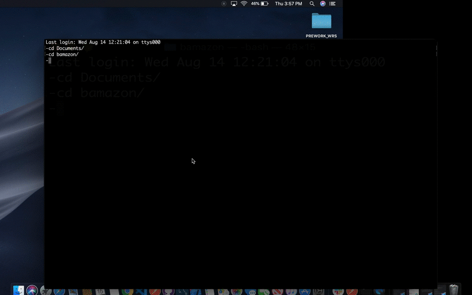
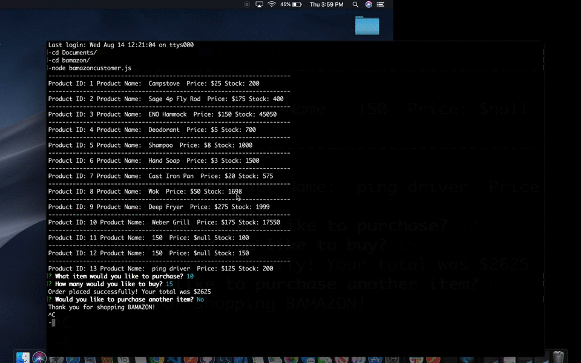
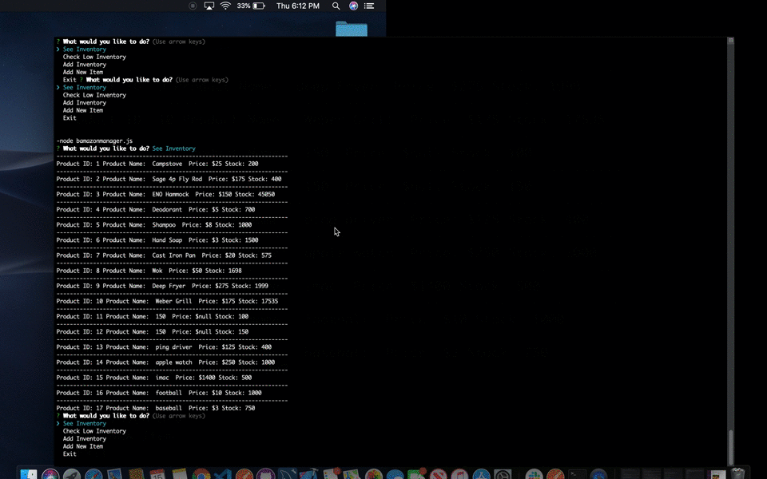

# bamazon
In this project, I created an Amazon-like storefront with MySQL . On the customer page, Bamazon allows a customer to make an order, while simultaneously depleteing the stock as the user shops.  
<h3>BAMAZONCUSTOMER</H3>

<h3>BAMAZONMANAGER INVENTORY AND LOW INVENTORY</H3>

<h3> BAMAZONMANAGER ADD INVENTORY AND ADD PRODUCT</h3>

